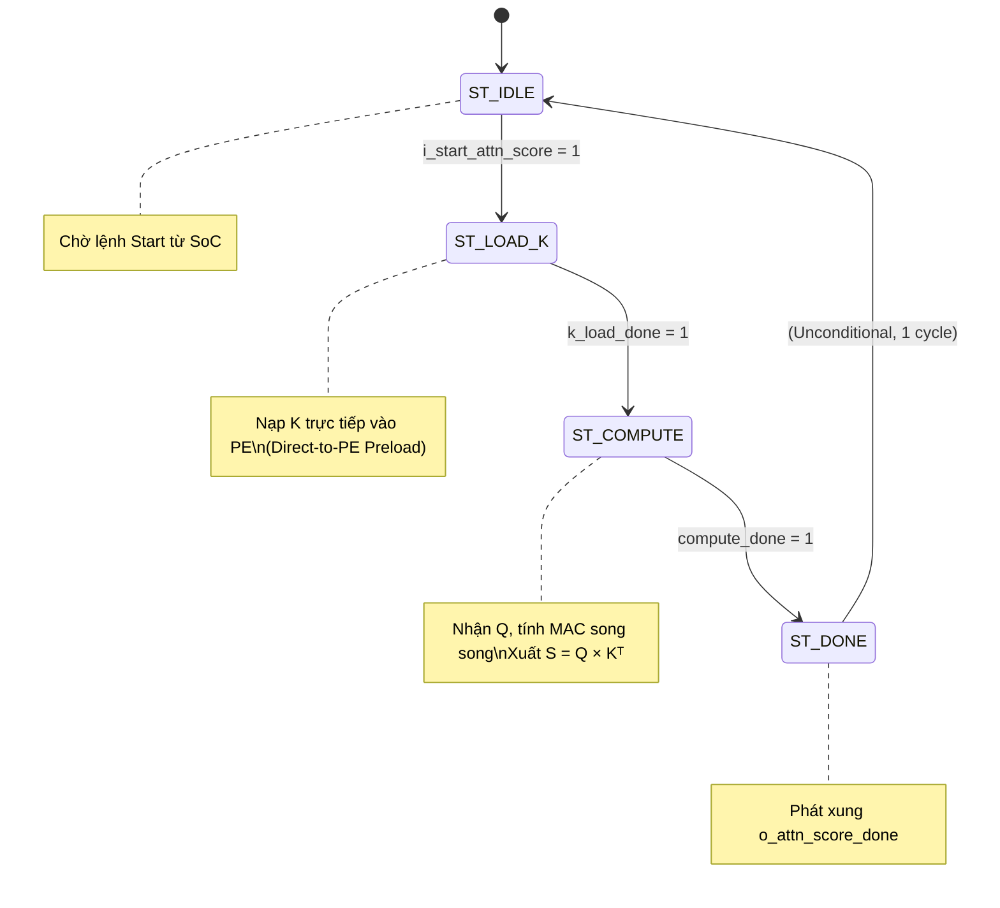
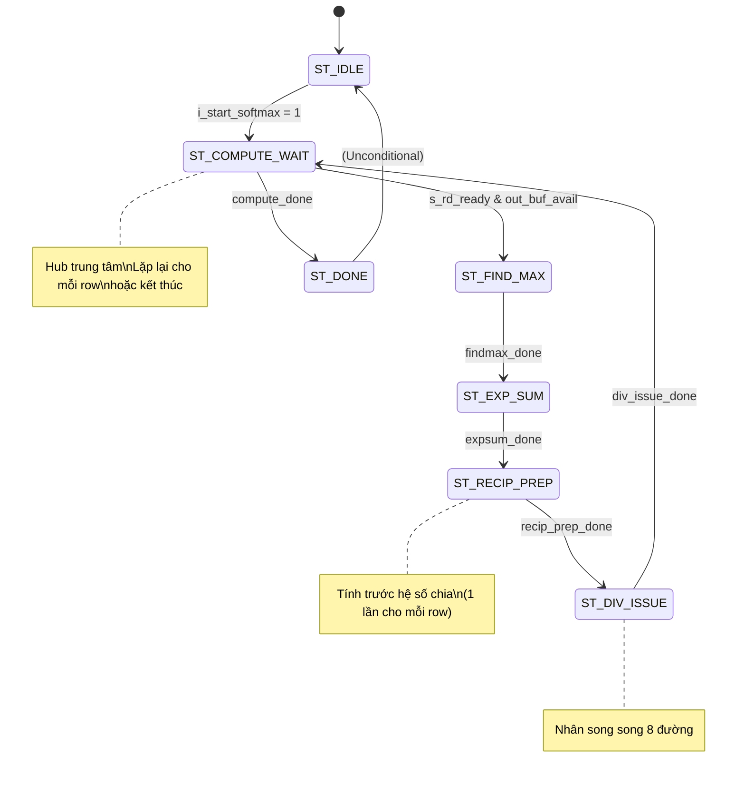

# Phân Tích Chi Tiết Máy Trạng Thái (FSM)
## IP Linear v5.0 & IP Softmax v1.0 — Phiên Bản Optimized

> **Ngày lập:** 09/08/2026  
> **Dự án:** IP Attention Accelerator trên FPGA Xilinx Kria KV260  
> **Phạm vi:** Phân tích toàn diện FSM của hai lõi IP theo 8 tiêu chí kỹ thuật, kèm trích dẫn mã nguồn RTL

---

## Mục Lục

- [Phần A: IP Linear](#phần-a-ip-linear-linearsv)
  - [A.1 Sơ đồ chuyển trạng thái](#a1-sơ-đồ-chuyển-trạng-thái)
  - [A.2 Phân tích từng trạng thái](#a2-phân-tích-từng-trạng-thái)
  - [A.3 Ping-Pong Buffer](#a3-ping-pong-buffer-synchronization)
  - [A.4 Pipeline Overlap](#a4-pipeline-overlap--throughput)
  - [A.5 Bộ đếm & Chỉ số](#a5-counter--index-management)
  - [A.6 Reset & Khởi tạo](#a6-reset--initialization)
  - [A.7 Tín hiệu Done/Busy](#a7-donebusy-signal-generation)
  - [A.8 Cycle Count Analysis](#a8-cycle-count-analysis)
- [Phần B: IP Softmax](#phần-b-ip-softmax-softmaxsv)
  - [B.1 Sơ đồ chuyển trạng thái](#b1-sơ-đồ-chuyển-trạng-thái)
  - [B.2 Phân tích từng trạng thái](#b2-phân-tích-từng-trạng-thái)
  - [B.3 Ping-Pong Buffer](#b3-ping-pong-buffer-synchronization)
  - [B.4 Pipeline Chia 8 đường](#b4-pipeline-chia-8-đường-song-song)
  - [B.5 Pipeline Overlap](#b5-pipeline-overlap--throughput)
  - [B.6 Bộ đếm & Chỉ số](#b6-counter--index-management)
  - [B.7 Reset & Khởi tạo](#b7-reset--initialization)
  - [B.8 Tín hiệu Done/Busy](#b8-donebusy-signal-generation)
  - [B.9 Cycle Count Analysis](#b9-cycle-count-analysis)

---

# Phần A: IP Linear (`linear.sv`)

## A.1 Sơ Đồ Chuyển Trạng Thái

### Định nghĩa FSM

```systemverilog
typedef enum logic [2:0] {
    ST_IDLE    = 3'b000,
    ST_LOAD_K  = 3'b001,
    ST_COMPUTE = 3'b011,
    ST_DONE    = 3'b100
} state_t;
state_t state;
```

### State Transition Diagram



### Logic chuyển trạng thái (RTL)

```systemverilog
always_ff @(posedge iclk or negedge irst_n) begin
    if (!irst_n) begin
        state <= ST_IDLE;
    end else begin
        case (state)
            ST_IDLE:
                if (i_start_attn_score)
                    state <= ST_LOAD_K;

            ST_LOAD_K:
                if (k_load_done)
                    state <= ST_COMPUTE;

            ST_COMPUTE:
                if (compute_done)
                    state <= ST_DONE;

            ST_DONE:
                state <= ST_IDLE;

            default:
                state <= ST_IDLE;
        endcase
    end
end
```

---

## A.2 Phân Tích Từng Trạng Thái

### A.2.1 `ST_IDLE` — Trạng thái nghỉ

**Chức năng:** Chờ tín hiệu `i_start_attn_score` từ AXI-Lite Slave. Khi nhận được, reset toàn bộ bộ đếm nạp K và chuyển sang `ST_LOAD_K`.

**Điều kiện chuyển tiếp:**
| Điều kiện | Trạng thái tiếp theo |
|:---|:---|
| `i_start_attn_score = 1` | `ST_LOAD_K` |

**Datapath — Khởi tạo bộ đếm nạp K:**

```systemverilog
if (state == ST_IDLE && i_start_attn_score) begin
    load_row_j    <= '0;
    load_col_k    <= '0;
    load_tile_idx <= '0;
end
```

**AXI-Stream — Không nhận dữ liệu:**

```systemverilog
assign o_s_axis_tready = (state == ST_LOAD_K)  ? 1'b1 :
                         (state == ST_COMPUTE)  ? (~q_wr_bank_full & ~q_all_loaded) :
                                                   1'b0;
// → Ở ST_IDLE: o_s_axis_tready = 0 (từ chối mọi giao dịch AXI-Stream)
```

---

### A.2.2 `ST_LOAD_K` — Nạp trọng số K trực tiếp vào PE

**Chức năng:** Nhận toàn bộ ma trận $K$ ($D\_HEAD \times D\_MODEL$ phần tử) từ AXI-Stream và nạp **trực tiếp** vào thanh ghi trọng số bên trong mảng PE (`matmul_ip`), không qua BRAM trung gian.

**Điều kiện chuyển tiếp:**
| Điều kiện | Trạng thái tiếp theo |
|:---|:---|
| `k_load_done = 1` (nhận beat cuối cùng, `tlast` hoặc đủ số lượng) | `ST_COMPUTE` |

**AXI-Stream — Luôn sẵn sàng nhận:**

```systemverilog
assign o_s_axis_tready = (state == ST_LOAD_K) ? 1'b1 : ...;
// → Ở ST_LOAD_K: LUÔN accept data (tready = 1), không bao giờ backpressure
```

**Tín hiệu hoàn thành nạp K:**

```systemverilog
assign load_k_beat_valid = i_s_axis_tvalid & o_s_axis_tready & (state == ST_LOAD_K);
assign k_load_done       = load_k_beat_valid & i_s_axis_tlast;
```

**Datapath — Đếm địa chỉ và nạp vào PE:**

```systemverilog
// Bộ đếm 3 chiều: col_k (D_MODEL) → row_j (N_PE) → tile_idx (N_TILES)
if (load_k_beat_valid) begin
    if (load_col_k == K_W'(D_MODEL - 1)) begin
        load_col_k <= '0;
        if (load_row_j == P_W'(N_PE - 1)) begin
            load_row_j    <= '0;
            load_tile_idx <= load_tile_idx + 1;
        end else begin
            load_row_j <= load_row_j + 1;
        end
    end else begin
        load_col_k <= load_col_k + 1;
    end
end
```

**Kết nối tới `matmul_ip` (Direct-to-PE Preload):**

```systemverilog
matmul_ip #(...) u_matmul_ip (
    ...
    .i_preload_en        (matmul_preload_en),
    .i_preload_j         (matmul_preload_j),
    .i_preload_k         (matmul_preload_k),
    .i_preload_data      (i_s_axis_tdata[DATA_WIDTH-1:0]),  // Dữ liệu K từ AXI-Stream
    .i_preload_tile_sel  (matmul_preload_tile_sel),
    ...
);
```

---

### A.2.3 `ST_COMPUTE` — Tính toán MAC song song

**Chức năng:** Đây là trạng thái phức tạp nhất, thực hiện đồng thời nhiều hoạt động:
1. **Q Loader**: Nhận từng hàng $Q$ ($D\_MODEL$ phần tử) từ AXI-Stream vào Ping-Pong buffer.
2. **MAC Engine**: Broadcast dữ liệu $Q$ tới $N\_PE$ PE song song, tích lũy tích vô hướng.
3. **Serializer**: Xuất kết quả hàng đã hoàn thành ra AXI-Stream Master.

**Điều kiện chuyển tiếp:**
| Điều kiện | Trạng thái tiếp theo |
|:---|:---|
| `compute_done = 1` (toàn bộ $SEQ\_LEN$ hàng đã serialize xong) | `ST_DONE` |

**AXI-Stream Input — Backpressure có điều kiện:**

```systemverilog
assign o_s_axis_tready = ...
                         (state == ST_COMPUTE) ? (~q_wr_bank_full & ~q_all_loaded) :
                         ...;
// → Chỉ nhận Q khi: (1) buffer ghi chưa đầy, VÀ (2) chưa nạp đủ tất cả Q rows
```

**Ghi Q vào Ping-Pong Buffer (Explicit bank addressing):**

```systemverilog
assign q_transfer = (state == ST_COMPUTE) & i_s_axis_tvalid & o_s_axis_tready;

if (q_transfer) begin
    if (q_wr_bank == 1'b0)
        q_row_buf_0[q_col_k] <= $signed(i_s_axis_tdata[DATA_WIDTH-1:0]);
    else
        q_row_buf_1[q_col_k] <= $signed(i_s_axis_tdata[DATA_WIDTH-1:0]);

    q_col_k <= q_col_k + 1;
end
```

**MAC Engine — Kích hoạt và điều khiển Tile:**

```systemverilog
assign tile_mac_en = (state == ST_COMPUTE) & q_compute_active;

// Bộ đếm tile: tile_k_cnt (D_MODEL cycles/tile) → tile_idx (N_TILES tiles/row)
if (tile_mac_en) begin
    if (tile_k_cnt == K_W'(D_MODEL - 1)) begin
        tile_k_cnt <= '0;
        if (tile_idx == T_W'(N_TILES - 1)) begin
            q_compute_active <= 1'b0;       // Hết tile cho hàng này
            q_rd_bank        <= ~q_rd_bank; // Chuyển bank đọc Q
            compute_wr_bank  <= ~compute_wr_bank;
            tile_idx         <= '0;
        end else begin
            tile_idx <= tile_idx + 1;
        end
    end else begin
        tile_k_cnt <= tile_k_cnt + 1;
    end
end
```

**AXI-Stream Output — Serializer với backpressure:**

```systemverilog
assign o_m_axis_tvalid = serialize_active;
assign o_m_axis_tlast  = serialize_active
                       & (ser_col_j == J_W'(D_HEAD - 1))
                       & (ser_row_i == S_W'(SEQ_LEN - 1));
assign o_m_axis_tdata  = 32'(($signed(current_result_val)) >>> SQRT_SHIFT);

// Serializer CHỈ tiến lên khi downstream sẵn sàng (i_m_axis_tready = 1)
if (i_m_axis_tready) begin
    if (ser_col_j == J_W'(D_HEAD - 1)) begin
        // Hết 1 row → chuyển sang row tiếp theo
        ...
    end else begin
        ser_col_j <= ser_col_j + 1;
    end
end
```

---

### A.2.4 `ST_DONE` — Hoàn thành

**Chức năng:** Phát xung `o_attn_score_done` trong đúng 1 chu kỳ clock, reset serializer, rồi quay về `ST_IDLE` ngay lập tức (unconditional).

```systemverilog
assign o_attn_score_done = (state == ST_DONE);

// Reset serializer row counter
if (state == ST_DONE)
    ser_row_i <= '0;
```

---

## A.3 Ping-Pong Buffer Synchronization

### Khai báo buffer

```systemverilog
// Q Row Buffers (2 bank × D_MODEL phần tử × DATA_WIDTH bit)
logic signed [DATA_WIDTH-1:0] q_row_buf_0 [0:D_MODEL-1];
logic signed [DATA_WIDTH-1:0] q_row_buf_1 [0:D_MODEL-1];

// Result Buffers (2 bank × D_HEAD phần tử × DATA_WIDTH bit)
logic signed [DATA_WIDTH-1:0] result_buffer_0 [0:D_HEAD-1];
logic signed [DATA_WIDTH-1:0] result_buffer_1 [0:D_HEAD-1];
```

### Cơ chế đồng bộ Q Buffer

```
   AXI-Stream DMA                Q Buffer                    MAC Engine
  ═══════════════         ┌───────────────────┐          ═══════════════
  Ghi → bank 0  ────────► │ q_row_buf_0       │ ◄──────── Đọc ← bank 0
  (q_wr_bank=0)           │ q_bank_full[0]    │           (q_rd_bank=0)
                          ├───────────────────┤
  Ghi → bank 1  ────────► │ q_row_buf_1       │ ◄──────── Đọc ← bank 1
  (q_wr_bank=1)           │ q_bank_full[1]    │           (q_rd_bank=1)
                          └───────────────────┘
```

**Cờ đồng bộ (Synchronization Flags):**

```systemverilog
// Điều kiện stall: ngăn ghi đè buffer đang được đọc
assign q_wr_bank_full = (q_wr_bank == 1'b0) ? q_bank_full[0] : q_bank_full[1];

// Bank đánh dấu ĐẦY khi Q row loaded, TRỐNG khi MAC engine đọc xong
if (q_row_loaded && q_wr_bank == 1'b0)
    q_bank_full[0] <= 1'b1;
else if (compute_row_done && q_rd_bank == 1'b0)
    q_bank_full[0] <= 1'b0;
```

### Cơ chế đồng bộ Result Buffer

```systemverilog
// Điều kiện stall: ngăn ghi đè buffer đang được serialize
assign write_buf_avail = (compute_wr_bank == 1'b0) ? ~result_pending[0] : ~result_pending[1];

// Bank đánh dấu PENDING khi MAC ghi xong 1 row, CLEARED khi Serializer xuất hết row
if (row_complete_pulse && buf_write_sel == 1'b0)
    result_pending[0] <= 1'b1;
else if (ser_finish_pulse && ser_rd_bank == 1'b0)
    result_pending[0] <= 1'b0;
```

---

## A.4 Pipeline Overlap & Throughput

Trong `ST_COMPUTE`, ba hoạt động chạy **đồng thời** (concurrent) nhờ cơ chế Ping-Pong:

```
 Thời gian ──────────────────────────────────────────────────────────────►

 Q Loader:    [Load Q row 0] [Load Q row 1] [Load Q row 2] ...
                    ↓              ↓              ↓
 MAC Engine:       idle      [MAC  row 0 ] [MAC  row 1 ] [MAC row 2] ...
                                   ↓              ↓           ↓
 Serializer:       idle           idle      [Ser  row 0] [Ser row 1] ...
```

- **Q Loader** ghi vào bank A trong khi **MAC Engine** đọc từ bank B.
- **MAC Engine** ghi kết quả vào result bank X trong khi **Serializer** đọc từ result bank Y.
- Khi cả hai bên hoàn thành, các bank hoán đổi vai trò.

**Điều kiện khởi động MAC cho row mới:**

```systemverilog
if (q_rd_ready && write_buf_avail) begin
    q_compute_active <= 1'b1;
end
// MAC chỉ bắt đầu khi CẢ HAI điều kiện thỏa:
// (1) q_rd_ready: Q buffer có dữ liệu sẵn sàng
// (2) write_buf_avail: Result buffer có chỗ trống để ghi
```

---

## A.5 Counter & Index Management

| Bộ đếm | Phạm vi | Trạng thái sử dụng | Mô tả |
|:---|:---|:---|:---|
| `load_col_k` | `0 .. D_MODEL-1` | `ST_LOAD_K` | Cột K đang nạp |
| `load_row_j` | `0 .. N_PE-1` | `ST_LOAD_K` | Hàng K trong tile |
| `load_tile_idx` | `0 .. N_TILES-1` | `ST_LOAD_K` | Tile đang nạp |
| `q_col_k` | `0 .. D_MODEL-1` | `ST_COMPUTE` | Cột Q đang nhận |
| `tile_k_cnt` | `0 .. D_MODEL-1` | `ST_COMPUTE` | Chu kỳ MAC trong tile |
| `tile_idx` | `0 .. N_TILES-1` | `ST_COMPUTE` | Tile đang tính |
| `ser_col_j` | `0 .. D_HEAD-1` | `ST_COMPUTE` | Cột đang serialize |
| `ser_row_i` | `0 .. SEQ_LEN-1` | `ST_COMPUTE` | Hàng đang serialize |

---

## A.6 Reset & Initialization

Tất cả `always_ff` block sử dụng **Asynchronous Active-Low Reset** (`negedge irst_n`):

```systemverilog
// FSM
if (!irst_n) state <= ST_IDLE;

// K Load counters
if (!irst_n) begin load_row_j <= '0; load_col_k <= '0; load_tile_idx <= '0; end

// Q Loader
if (!irst_n) begin q_col_k <= '0; q_wr_bank <= 1'b0; q_all_loaded <= 1'b0; end

// Q Bank flags
if (!irst_n) q_bank_full <= 2'b00;

// MAC control
if (!irst_n) begin q_compute_active <= 1'b0; tile_idx <= '0; tile_k_cnt <= '0; end

// Result buffers (xóa toàn bộ nội dung)
if (!irst_n) begin
    buf_write_sel <= 1'b0;
    for (int i = 0; i < D_HEAD; i++) begin
        result_buffer_0[i] <= '0;
        result_buffer_1[i] <= '0;
    end
end

// Serializer
if (!irst_n) begin serialize_active <= 1'b0; ser_col_j <= '0; ser_row_i <= '0; end

// Cycle counter
if (!irst_n) linear_cycles <= 0;
```

---

## A.7 Done/Busy Signal Generation

```systemverilog
assign o_busy            = (state != ST_IDLE);
assign o_attn_score_done = (state == ST_DONE);
```

- `o_busy` = `1` trong suốt `ST_LOAD_K` → `ST_COMPUTE` → `ST_DONE`.
- `o_attn_score_done` chỉ active đúng **1 chu kỳ** (duration = 1 clock cycle tại `ST_DONE`).

**Hardware Cycle Counter:**

```systemverilog
logic [31:0] linear_cycles;
assign o_linear_cycles = linear_cycles;

always_ff @(posedge iclk or negedge irst_n) begin
    if (!irst_n)
        linear_cycles <= 0;
    else if (i_start_attn_score)
        linear_cycles <= 0;           // Reset khi bắt đầu lượt mới
    else if (o_busy)
        linear_cycles <= linear_cycles + 1;  // Đếm mỗi cycle khi busy
end
```

---

## A.8 Cycle Count Analysis

Với tham số mặc định: $D\_MODEL = 64$, $SEQ\_LEN = 64$, $D\_HEAD = 64$, $N\_PE = 64$, $N\_TILES = 1$.

| Trạng thái | Số chu kỳ | Công thức |
|:---|---:|:---|
| `ST_LOAD_K` | $4{,}096$ | $D\_HEAD \times D\_MODEL = 64 \times 64$ |
| `ST_COMPUTE` | $\approx 64 \times (64 + \alpha)$ | $SEQ\_LEN \times (D\_MODEL \times N\_TILES + \text{overhead})$ |
| `ST_DONE` | $1$ | Cố định |
| **Tổng ước tính** | **$\approx 8{,}200$** | Phụ thuộc backpressure |

> **Lưu ý:** Nhờ Ping-Pong overlap, Q Loading và MAC có thể chạy đồng thời. Thời gian thực tế của `ST_COMPUTE` phụ thuộc vào tốc độ cấp dữ liệu của DMA (backpressure) và tốc độ tiêu thụ của downstream (Softmax IP).

---
---

# Phần B: IP Softmax (`softmax.sv`)

## B.1 Sơ Đồ Chuyển Trạng Thái

### Định nghĩa FSM

```systemverilog
typedef enum logic [3:0] {
    ST_IDLE         = 4'd0,
    ST_COMPUTE_WAIT = 4'd1,
    ST_FIND_MAX     = 4'd2,
    ST_EXP_SUM      = 4'd3,
    ST_RECIP_PREP   = 4'd4,
    ST_DIV_ISSUE    = 4'd5,
    ST_DONE         = 4'd7
} state_t;
state_t state;
```

### State Transition Diagram



### Logic chuyển trạng thái (RTL)

```systemverilog
always_ff @(posedge iclk or negedge irst_n) begin
    if (!irst_n) begin
        state <= ST_IDLE;
    end else begin
        case (state)
            ST_IDLE:
                if (i_start_softmax)
                    state <= ST_COMPUTE_WAIT;

            ST_COMPUTE_WAIT:
                if (compute_done)
                    state <= ST_DONE;
                else if (s_rd_ready && out_buf_avail)
                    state <= ST_FIND_MAX;

            ST_FIND_MAX:
                if (findmax_done)
                    state <= ST_EXP_SUM;

            ST_EXP_SUM:
                if (expsum_done)
                    state <= ST_RECIP_PREP;

            ST_RECIP_PREP:
                if (recip_prep_done)
                    state <= ST_DIV_ISSUE;

            ST_DIV_ISSUE:
                if (div_issue_done)
                    state <= ST_COMPUTE_WAIT;

            ST_DONE:
                state <= ST_IDLE;
        endcase
    end
end
```

---

## B.2 Phân Tích Từng Trạng Thái

### B.2.1 `ST_IDLE` — Trạng thái nghỉ

**Điều kiện chuyển tiếp:**
| Điều kiện | Trạng thái tiếp theo |
|:---|:---|
| `i_start_softmax = 1` | `ST_COMPUTE_WAIT` |

**Datapath — Reset control signals:**

```systemverilog
if (state == ST_IDLE || state == ST_DONE) begin
    s_col_k      <= '0;
    s_wr_bank    <= 1'b0;
    s_all_loaded <= 1'b0;
end
```

**AXI-Stream — Không nhận dữ liệu:**

```systemverilog
assign o_s_axis_tready = (state != ST_IDLE && state != ST_DONE)
                       ? (~s_wr_bank_full & ~s_all_loaded)
                       : 1'b0;
// → Ở ST_IDLE: o_s_axis_tready = 0
```

---

### B.2.2 `ST_COMPUTE_WAIT` — Hub điều phối trung tâm

**Chức năng:** Đây là trạng thái "ngã tư" (hub) mà FSM quay lại sau mỗi row. Nó kiểm tra hai điều kiện:
1. Nếu đã xử lý hết tất cả row → chuyển sang `ST_DONE`.
2. Nếu còn row và buffer sẵn sàng → khởi tạo Find Max cho row tiếp theo.

**Điều kiện chuyển tiếp:**
| Ưu tiên | Điều kiện | Trạng thái tiếp theo |
|:---:|:---|:---|
| 1 | `compute_done = 1` | `ST_DONE` |
| 2 | `s_rd_ready & out_buf_avail` | `ST_FIND_MAX` |
| — | Không thỏa điều kiện nào | Giữ nguyên (stall) |

**Datapath — Khởi tạo biến cho Find Max:**

```systemverilog
if (state == ST_COMPUTE_WAIT && s_rd_ready && out_buf_avail) begin
    max_val     <= {1'b1, {(DATA_WIDTH-1){1'b0}}};  // = giá trị signed nhỏ nhất
    findmax_idx <= '0;
end
```

---

### B.2.3 `ST_FIND_MAX` — Tìm giá trị lớn nhất

**Chức năng:** Quét tuần tự $D\_HEAD$ phần tử trong `s_row_buf` để tìm `max_val` (dùng cho Stable Softmax).

**Điều kiện chuyển tiếp:**
| Điều kiện | Trạng thái tiếp theo |
|:---|:---|
| `findmax_done = 1` (đã quét hết `D_HEAD` phần tử) | `ST_EXP_SUM` |

**Datapath:**

```systemverilog
if (state == ST_FIND_MAX) begin
    // So sánh signed: cập nhật max nếu phần tử hiện tại lớn hơn
    if (current_s_val > max_val)
        max_val <= current_s_val;

    // Bộ đếm quét
    if (findmax_idx == J_W'(D_HEAD - 1)) begin
        findmax_idx  <= '0;
        findmax_done <= 1'b1;
    end else begin
        findmax_idx <= findmax_idx + 1;
    end
end
```

**Khởi tạo cho trạng thái tiếp theo (ST_EXP_SUM):**

```systemverilog
if (state == ST_FIND_MAX && findmax_done) begin
    scan_idx    <= '0;
    scan_active <= 1'b1;
    rom_valid_q <= 1'b0;
    sum_acc     <= '0;
end
```

---

### B.2.4 `ST_EXP_SUM` — Tra ROM Exp và Tích lũy tổng

**Chức năng:** Với mỗi phần tử $s_i$ trong row:
1. Tính $z = s_i - \text{max\_val}$ (luôn $\le 0$).
2. Tra ROM: `addr = (-z) & 0x7FF` → `exp_rom_data`.
3. Lưu kết quả vào `exp_row_buf[i]`.
4. Cộng dồn vào `sum_acc`.

**Điều kiện chuyển tiếp:**
| Điều kiện | Trạng thái tiếp theo |
|:---|:---|
| `expsum_done = 1` | `ST_RECIP_PREP` |

**Datapath — Pipeline 2 tầng (bù latency ROM 1 cycle):**

```systemverilog
if (state == ST_EXP_SUM) begin
    // Tầng 1: Phát địa chỉ ROM, tăng scan_idx
    if (scan_active) begin
        if (scan_idx == J_W'(D_HEAD - 1))
            scan_active <= 1'b0;
        else
            scan_idx <= scan_idx + 1;
    end

    rom_idx_q   <= scan_idx;    // Lưu index để dùng ở tầng 2
    rom_valid_q <= scan_active; // Pipeline valid signal

    // Tầng 2: Nhận data từ ROM (1 cycle sau), lưu và cộng dồn
    if (rom_valid_q) begin
        exp_row_buf[rom_idx_q] <= exp_rom_data;
        sum_acc <= sum_acc + SUM_WIDTH'(exp_rom_data);

        if (rom_idx_q == J_W'(D_HEAD - 1)) begin
            sum_latched <= sum_acc + SUM_WIDTH'(exp_rom_data);
            expsum_done <= 1'b1;
        end
    end
end
```

---

### B.2.5 `ST_RECIP_PREP` — Chuẩn bị hệ số chia (1 lần/row)

**Chức năng:** Tính toán trước các hệ số cho phép chia reciprocal, **chỉ cần thực hiện 1 lần** cho mỗi row (vì tất cả phần tử cùng chia cho `sum_latched`).

**Điều kiện chuyển tiếp:**
| Điều kiện | Trạng thái tiếp theo |
|:---|:---|
| `recip_prep_done = 1` (sau 2 cycle) | `ST_DIV_ISSUE` |

**Mạch tổ hợp — Priority Encoder (tìm MSB):**

```systemverilog
always_comb begin
    msb_pos_c   = '0;
    msb_found_c = 1'b0;
    for (int b = SUM_WIDTH-1; b >= 0; b--) begin
        if (!msb_found_c && sum_latched[b]) begin
            msb_pos_c   = MSB_W_RECIP'(b);
            msb_found_c = 1'b1;
        end
    end
end
```

**Mạch tổ hợp — Tính địa chỉ ROM nghịch đảo:**

```systemverilog
always_comb begin
    if (int'(msb_pos_c) >= RECIP_ADDR_W)
        recip_addr_c = sum_latched[int'(msb_pos_c)-1 -: RECIP_ADDR_W];
    else
        recip_addr_c = RECIP_ADDR_W'(sum_latched) << (RECIP_ADDR_W - int'(msb_pos_c));
end
```

**Datapath — Chờ ROM trả dữ liệu (2 cycle):**

```systemverilog
if (state == ST_RECIP_PREP) begin
    if (!recip_prep_cnt) begin
        recip_prep_cnt <= 1'b1;          // Cycle 1: chờ ROM latency
    end else begin
        precomp_recip   <= recip_rom_data;    // Cycle 2: latch kết quả ROM
        precomp_shift   <= SHIFT_W_RECIP'(RECIP_OUT_W) + SHIFT_W_RECIP'(msb_pos_c);
        recip_prep_done <= 1'b1;
    end
end
```

---

### B.2.6 `ST_DIV_ISSUE` — Phép chia song song 8 đường

**Chức năng:** Thực hiện phép chia $\frac{exp_i \times 2^{15}}{sum}$ cho tất cả $D\_HEAD$ phần tử, xử lý **8 phần tử mỗi chu kỳ** clock.

**Điều kiện chuyển tiếp:**
| Điều kiện | Trạng thái tiếp theo |
|:---|:---|
| `div_issue_done = 1` | `ST_COMPUTE_WAIT` (quay lại hub, xử lý row tiếp) |

**Datapath — Pipeline 8-way:**

```systemverilog
if (state == ST_DIV_ISSUE) begin
    // Tầng Issue: Nhân 8 phần tử cùng lúc, lưu kết quả nhân vào thanh ghi
    if (div_issue_active) begin
        for (int i = 0; i < NUM_WAYS; i++)
            div_prod_reg[i] <= div_prod[i];

        div_wr_idx    <= div_in_idx;
        div_wr_active <= 1'b1;

        if (div_in_idx == J_W'(D_HEAD - NUM_WAYS))
            div_issue_active <= 1'b0;
        else
            div_in_idx <= div_in_idx + J_W'(NUM_WAYS);  // Tăng 8 mỗi cycle
    end else begin
        div_wr_active <= 1'b0;
    end

    // Tầng Write-back: Dịch bit, bão hòa, ghi vào output buffer
    if (div_wr_active) begin
        for (int i = 0; i < NUM_WAYS; i++) begin
            if (int'(div_wr_idx) + i < D_HEAD) begin
                if (compute_out_wr_bank == 1'b0)
                    out_row_buf_0[div_wr_idx + J_W'(i)] <= div_result[i];
                else
                    out_row_buf_1[div_wr_idx + J_W'(i)] <= div_result[i];
            end
        end
    end
end
```

---

### B.2.7 `ST_DONE` — Hoàn thành

```systemverilog
ST_DONE:
    state <= ST_IDLE;  // Unconditional, 1 cycle
```

**Tín hiệu:**

```systemverilog
assign o_softmax_done = (state == ST_DONE);
```

---

## B.3 Ping-Pong Buffer Synchronization

### Khai báo buffer

```systemverilog
logic signed [DATA_WIDTH-1:0] s_row_buf_0 [0:D_HEAD-1];   // Input S buffer bank 0
logic signed [DATA_WIDTH-1:0] s_row_buf_1 [0:D_HEAD-1];   // Input S buffer bank 1
logic        [EXP_WIDTH-1:0]  exp_row_buf [0:D_HEAD-1];    // Exp results (single)
logic        [EXP_WIDTH-1:0]  out_row_buf_0 [0:D_HEAD-1];  // Output buffer bank 0
logic        [EXP_WIDTH-1:0]  out_row_buf_1 [0:D_HEAD-1];  // Output buffer bank 1
```

### Điều kiện Stall

```systemverilog
assign s_rd_ready    = (s_rd_bank == 1'b0) ? s_bank_full[0] : s_bank_full[1];
assign out_buf_avail = (compute_out_wr_bank == 1'b0) ? ~result_pending[0] : ~result_pending[1];
assign s_wr_bank_full = (s_wr_bank == 1'b0) ? s_bank_full[0] : s_bank_full[1];
```

FSM **stall** tại `ST_COMPUTE_WAIT` khi:
- `s_rd_ready = 0`: Chưa có row nào sẵn sàng để xử lý.
- `out_buf_avail = 0`: Buffer đầu ra đang bận (Serializer chưa xuất xong row trước).

### Chuyển bank

```systemverilog
if (compute_row_done) begin
    s_rd_bank           <= ~s_rd_bank;
    compute_out_wr_bank <= ~compute_out_wr_bank;
end
```

---

## B.4 Pipeline Chia 8 Đường Song Song

### Mạch tổ hợp — 8 bộ nhân + dịch + bão hòa

```systemverilog
genvar w;
generate
    for (w = 0; w < NUM_WAYS; w++) begin : gen_div_ways
        // Tử số Q1.15: nối exp value với 15 bit 0
        assign div_dividend[w] = {exp_row_buf[div_in_idx + J_W'(w)], 15'd0};
        // Nhân với giá trị nghịch đảo đã tra ROM
        assign div_prod[w]     = div_dividend[w] * precomp_recip;
        // Dịch bit động (shift amount đã precompute)
        assign div_shifted[w]  = div_prod_reg[w] >> precomp_shift;
        // Bão hòa: clamp về MAX_Q15 nếu vượt quá
        assign div_result[w]   = (div_shifted[w] > PROD_WIDTH'(MAX_Q15))
                               ? MAX_Q15
                               : EXP_WIDTH'(div_shifted[w]);
    end
endgenerate
```

### Sub-module instances

```systemverilog
exp_rom u_exp_rom (
    .clka  (iclk),
    .ena   (1'b1),
    .addra (exp_rom_addr),
    .douta (exp_rom_data)
);

recip_rom u_recip_rom (
    .clka  (iclk),
    .ena   (1'b1),
    .addra (recip_addr_c),
    .douta (recip_rom_data)
);
```

> Không có instantiation module `reciprocal_divider` riêng biệt. Toàn bộ phép chia được thực hiện **inline** trong `softmax.sv`.

---

## B.5 Pipeline Overlap & Throughput

```
Thời gian ──────────────────────────────────────────────────────────────────►

AXI-Stream In:  [Load S row 0]  [Load S row 1]  [Load S row 2]  ...
                      ↓               ↓               ↓
Compute:            idle        [FindMax→Exp→     [FindMax→Exp→
                                 Prep→Div row0]    Prep→Div row1]   ...
                                      ↓               ↓
AXI-Stream Out:     idle             idle         [Serialize row0] ...
```

Nhờ Ping-Pong buffer, **nạp row mới** và **xử lý row cũ** có thể overlap.

---

## B.6 Counter & Index Management

| Bộ đếm | Phạm vi | Trạng thái sử dụng | Mô tả |
|:---|:---|:---|:---|
| `s_col_k` | `0 .. D_HEAD-1` | Loading (background) | Cột S đang nạp |
| `findmax_idx` | `0 .. D_HEAD-1` | `ST_FIND_MAX` | Chỉ số quét tìm max |
| `scan_idx` | `0 .. D_HEAD-1` | `ST_EXP_SUM` | Chỉ số quét tra ROM exp |
| `rom_idx_q` | `0 .. D_HEAD-1` | `ST_EXP_SUM` | Pipeline delay index (tầng 2) |
| `recip_prep_cnt` | `0 .. 1` | `ST_RECIP_PREP` | Đếm 2 cycle chờ ROM |
| `div_in_idx` | `0 .. D_HEAD-1` (step 8) | `ST_DIV_ISSUE` | Chỉ số issue (nhảy 8) |
| `div_wr_idx` | `0 .. D_HEAD-1` (step 8) | `ST_DIV_ISSUE` | Chỉ số write-back |
| `ser_col_j` | `0 .. D_HEAD-1` | Serializer | Cột đang serialize |
| `ser_row_i` | `0 .. SEQ_LEN-1` | Serializer | Hàng đang serialize |

---

## B.7 Reset & Initialization

```systemverilog
// FSM
if (!irst_n) state <= ST_IDLE;

// Loading control
if (!irst_n) begin s_col_k <= '0; s_wr_bank <= 1'b0; s_all_loaded <= 1'b0; end

// Bank flags
if (!irst_n) begin s_bank_full <= 2'b00; result_pending <= 2'b00; end

// Compute control
if (!irst_n) begin s_rd_bank <= 1'b0; compute_out_wr_bank <= 1'b0; end

// Serializer
if (!irst_n) begin ser_col_j <= '0; ser_row_i <= '0; end

// Cycle counter
if (!irst_n) softmax_cycles <= 0;
```

---

## B.8 Done/Busy Signal Generation

```systemverilog
assign o_busy         = (state != ST_IDLE);
assign o_softmax_done = (state == ST_DONE);
```

**Hardware Cycle Counter:**

```systemverilog
logic [31:0] softmax_cycles;
assign o_softmax_cycles = softmax_cycles;

always_ff @(posedge iclk or negedge irst_n) begin
    if (!irst_n)
        softmax_cycles <= 0;
    else if (i_start_softmax)
        softmax_cycles <= 0;
    else if (o_busy)
        softmax_cycles <= softmax_cycles + 1;
end
```

---

## B.9 Cycle Count Analysis

Với tham số mặc định: $D\_HEAD = 64$, $SEQ\_LEN = 64$, $NUM\_WAYS = 8$.

Phân tích cho **1 row**:

| Trạng thái | Số chu kỳ | Công thức / Giải thích |
|:---|---:|:---|
| `ST_COMPUTE_WAIT` | $1$ | Kiểm tra điều kiện, chuyển tiếp |
| `ST_FIND_MAX` | $64$ | $D\_HEAD$ (quét tuần tự) |
| `ST_EXP_SUM` | $66$ | $D\_HEAD + 2$ (pipeline 2 tầng, thêm 2 cycle latency) |
| `ST_RECIP_PREP` | $2$ | Cố định (1 cycle chờ ROM + 1 cycle latch) |
| `ST_DIV_ISSUE` | $9$ | $\lceil D\_HEAD / NUM\_WAYS \rceil + 1 = 64/8 + 1$ (pipeline write-back) |
| **Tổng/row** | **$\approx 142$** | |
| **Tổng toàn bộ** | **$\approx 142 \times 64 = 9{,}088$** | $\text{cycles/row} \times SEQ\_LEN$ |
| `ST_DONE` | $1$ | Cố định |

> **Lưu ý:** Con số thực tế có thể thấp hơn nhờ Ping-Pong overlap giữa Loading row mới và Serialize row cũ chạy song song với quá trình Compute.

---

*Hết báo cáo phân tích FSM.*
